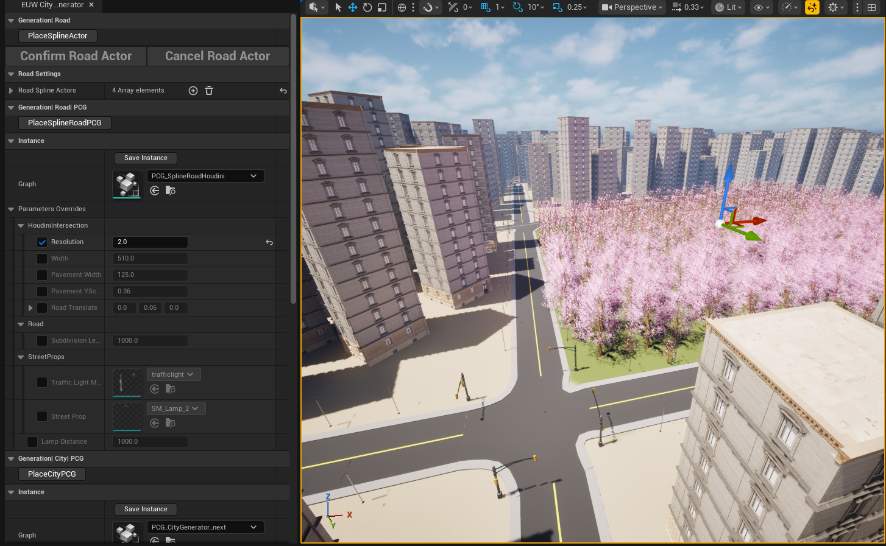

# UE5 PCG City Generation Tool

A procedural city generation tool built in Unreal Engine 5 using PCG, Blueprints, splines, and editor-based workflows.

The project explores how procedural tools can help artists and level designers create road layouts, building plots, and urban environments more quickly inside Unreal Engine.

## Features

* Spline-based road generation
* Houdini-generated road intersections
* PCG / PCGEx-based building and prop placement
* Editable workflow inside Unreal Engine
* Rapid city blockout and iteration

## My Contribution

I designed and developed the procedural workflow, focusing on tool usability and environment generation.

My work included:

* Building road and plot generation systems
* Integrating Houdini-generated intersection assets into the workflow
* Using PCG / PCGEx for procedural building and prop placement
* Testing and debugging generation issues
* Designing the workflow for artists and level designers

## Technologies Used

* Unreal Engine 5
* PCG / PCGEx
* Blueprints
* Houdini Engine
* Splines
* Git / GitHub

## Screenshots

